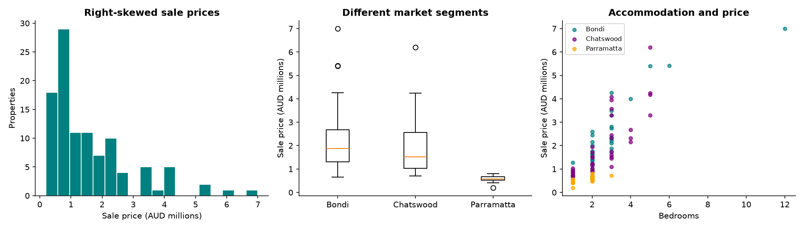
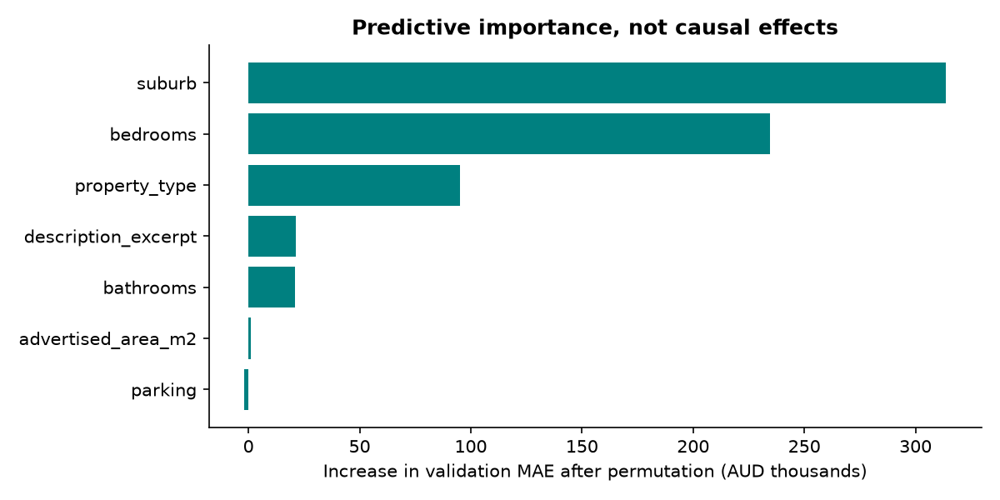
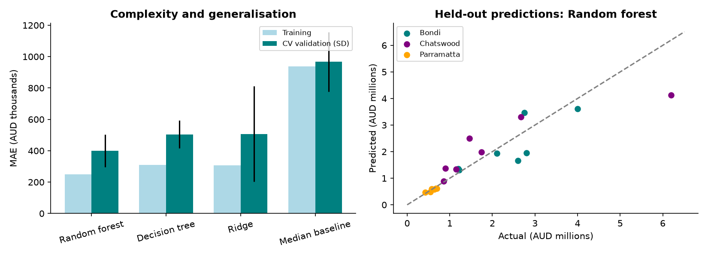
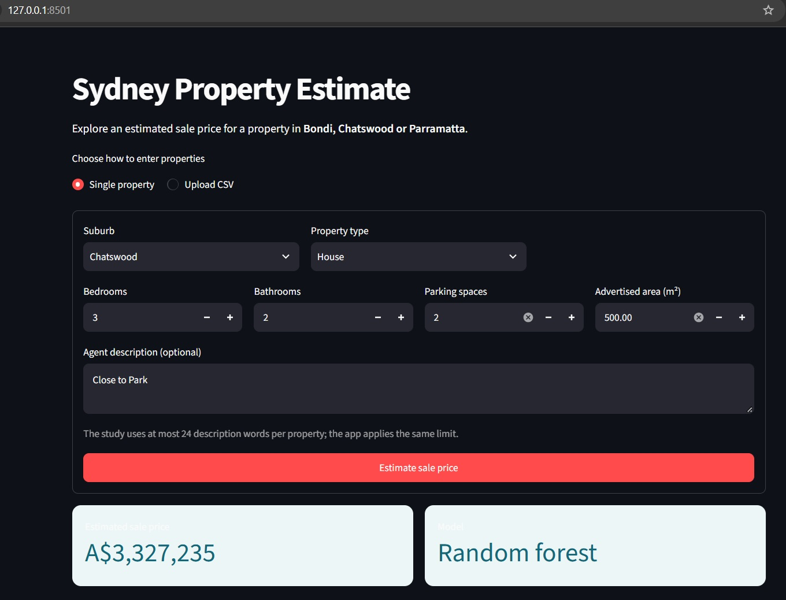
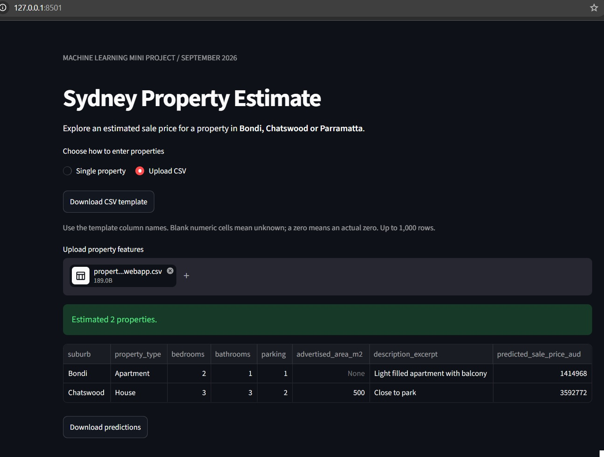

# Sydney Housing Price Prediction and Decision Support

*Machine Learning mini project ·

GitHub repository: https://github.com/sieglinde00/sydneyhouseprice.git

> **Scope:** The project includes 105 disclosed-price properties, three regression models, a historical student/LLM comparison and a local web app.

## 1. Problem definition and data collection

### Purpose and suburb selection

The aim is to estimate a residential property's sale price from its characteristics. This is **supervised learning** to model **regression**.

The intended use is to support a real estate agent's initial appraisal.

Three Sydney suburbs, Bondi, Chatswood and Parramatta were chosen. Bondi's coastal access, Chatswood's commercial centre and Parramatta's employment and infrastructure role provide reasons to expect different markets.

### Collection and retained information

Public sold listings from realestate.com.au for 105 properties were manually compiled into a CSV, with 35 from each suburb.

The table retains address, suburb, sale price, bedrooms, bathrooms, parking, advertised area, property type, detail availability and a description excerpt. Sale price is the target.


### Quality and selection bias

Parking is unknown for **18 properties**, area for **65**, and descriptions for **seven**. Missing parking is not treated as zero because an omitted figure does not prove that no space exists. Advertised area is also inconsistent: land, internal floor space and total title area are not interchangeable measurements.


## 2. Data understanding and feature engineering

### Exploratory findings

| Suburb | n | Median price |
| --- | --- | --- |
| Bondi | 35 | A$1,885,000 |
| Chatswood | 35 | A$1,518,000 |
| Parramatta | 35 | A$575,000 |

The histogram shows a **right-skewed distribution**: most prices are below the upper end, with a few expensive transactions stretching the range from A$200,000 to A$7 million. Medians are useful summaries because extreme prices influence them less than means. The box plots compare suburbs, while the bedroom scatter helps identify differences in accommodation and unusual observations.



The A$7 million transaction is a 12-bedroom block of units, not a typical family dwelling. Parramatta contains no detached houses, whereas Bondi and Chatswood include expensive houses. Suburb medians therefore reflect both location and property mix. Modelling different dwelling groups separately would require more examples.


### Feature choices and preparation

Before modelling, **suburb, property type and bedrooms** were expected to matter most. They represent broad location, dwelling form and accommodation capacity. Area might be highly influential with better data, but its missingness and inconsistent definitions made it less reliable here.

Missing numerical values are filled with training-data medians. This retains incomplete records and is less sensitive to extremes than mean imputation. Missing-value indicators allow the model to distinguish observed from imputed values. Numerical features are standardised, particularly to make Ridge's coefficient penalty comparable across variables with different scales. Trees generally do not require scaling, but share the same pipeline in code.

Suburb and property type use **one-hot encoding**, which creates category indicators without imposing a false numerical ordering. Bathroom-to-bedroom ratio summarises facilities relative to accommodation; a studio with zero bedrooms receives a missing ratio rather than a division-by-zero result. Description length is also included, although the 24-word cap limits its information.

Agent excerpts are converted to **TF–IDF** features, which represent words numerically according to their frequency and distinctiveness across training documents. The vocabulary is limited to 100 terms, each appearing in at least two training records. This restricts weak features in a small sample. Currency amounts, sale-result phrases and “SOLD” notices are stripped to reduce target leakage.

Validation permutation importance shuffles one feature and measures the resulting increase in error. The highest average importances are **suburb, bedrooms, property type**, supporting the initial expectations. These are predictive associations, not causal price effects. A low importance for area may reflect poor measurement, while correlated features can substitute for one another.



## 3. Model development and evaluation

### Why train on log price?

The natural logarithm compresses the wide price range, reducing the influence of expensive properties on squared-error training. Predicting A$1 million instead of A$2 million produces the same log-price error as predicting A$500,000 instead of A$1 million: both predictions are half the actual price. Training therefore emphasises proportional differences more than raw-dollar training, although it does not directly minimise MAPE.

The model learns `log(price)` and converts predictions back using `exp(predicted_log_price)`. All evaluation metrics are then calculated in dollars or percentages. The transformation requires positive targets and produces positive predictions. It can also help Ridge represent proportional rather than fixed-dollar relationships.

### Model selection and expectations

**Ridge regression** is an additive linear model on log price. It penalises large coefficients, reducing sensitivity to correlated or weak features. This makes it suitable for a small dataset with text inputs, but it does not automatically capture interactions such as bedrooms having different values across suburbs. Its regularisation strength, alpha, was fixed at 10.

**Decision tree regression** divides properties into groups using feature-based rules. It captures nonlinear thresholds and interactions, but unrestricted trees can fit accidental patterns. Maximum depth 4 and a minimum of five observations per leaf limit complexity, at the cost of potentially overlooking variation within each group.

**Random forest regression** averages many trees built with randomised samples and feature selection. It can capture interactions while reducing dependence on one tree's particular splits. The forest uses 250 trees, maximum depth 6, minimum leaf size 3 and feature fraction 0.8. It is less directly interpretable but practical for this dataset.

Before training, the forest was expected to perform best because of this combination of flexibility and averaging. Ridge remained a credible alternative because simpler models can generalise better with little data. Settings were fixed rather than tuned against test results. An additional **median baseline**, which ignores property features and predicts a constant central price, establishes whether modelling improves on a simple rule.

### Validation design and metrics

The dataset was split into **84 development and 21 test properties**, using suburb stratification and seed 42. Stratification preserves suburb representation, although rare types and price extremes may remain unevenly distributed. A fixed seed makes the split reproducible. The development sample uses **five-fold cross-validation** splits for every model.

Mean validation MAE selects the best regressor, which is refitted on all 84 development properties before test evaluation.


### Results and interpretation

| Model | Train MAE | CV MAE | Fold SD | CV RMSE | CV R² | CV MAPE % |
| --- | --- | --- | --- | --- | --- | --- |
| Random forest | A$248,348 | A$399,505 | A$104,026 | A$653,860 | 0.70 | 24.35 |
| Decision tree | A$308,622 | A$504,694 | A$88,091 | A$821,286 | 0.56 | 32.66 |
| Ridge | A$307,831 | A$506,375 | A$304,415 | A$1,007,260 | 0.29 | 25.39 |
| Median baseline | A$937,706 | A$966,717 | A$189,062 | A$1,388,032 | -0.17 | 66.33 |

The **Random forest** achieves the lowest mean validation MAE, **A$399,505**, compared with **A$966,717** for the baseline. This supports the initial expectation. Its training MAE of **A$248,348** is lower, revealing a generalisation gap. Some gap is expected, but it explains why training scores alone overstate usefulness.

The tree and Ridge have similar mean MAEs, but Ridge has larger fold variability and RMSE, suggesting greater sensitivity to difficult cases. The constrained tree may underfit differences within leaves while still fitting noise in a small sample. Increasing complexity is therefore not automatically beneficial. Fold standard deviation describes variation across partitions, not a confidence interval.

Held-out results are **MAE A$396,932**, **RMSE A$631,754**, **R² 0.792** and **MAPE 19.37%**. The baseline's test MAE is **A$973,886**. RMSE exceeding MAE indicates that large mistakes matter. In the prediction scatter, points below the diagonal are underpredictions and points above it are overpredictions.



Removing TF–IDF under the same settings and folds changes validation MAE from **A$399,505** to **A$394,689**, a small improvement. Thus, short-excerpt vocabulary did not demonstrate a benefit here. Description length remains in this ablation, so it is not a completely text-free comparison. The difference is small relative to fold variability. The text-inclusive forest remains the selected model from the planned three-model comparison; systematic feature-set selection would require further validation.

The forest is recommended for this prototype because it outperformed the alternatives under the stated protocol.


## 4. Investigating prediction failures

The following properties have the five largest absolute errors among the 21 held-out cases.

| Property | Suburb | Actual | Prediction | Absolute error | APE |
| --- | --- | --- | --- | --- | --- |
| 11 Crick Street | Chatswood | A$6,200,000 | A$4,136,049 | A$2,063,951 | 33.3% |
| 1/4 Sutherland Road | Chatswood | A$1,460,000 | A$2,496,316 | A$1,036,316 | 71.0% |
| 5601/34 Wellington Street | Bondi | A$2,600,000 | A$1,666,473 | A$933,527 | 35.9% |
| 5211/34 Wellington Street | Bondi | A$2,800,000 | A$1,948,330 | A$851,670 | 30.4% |
| 8B Castlefield Street | Bondi | A$2,750,000 | A$3,460,942 | A$710,942 | 25.9% |

#### Case 1: 11 Crick Street, Chatswood

The prediction was **A$2,063,951 below** the sale price (**33.3%** error).

This five-bedroom house has three bathrooms, three parking spaces and 746.1m² advertised area. The listing describes substantial construction and generous living spaces. The forest may average this luxury home with cheaper examples sharing broad attributes; log training may also reduce attention to its premium. Verified condition and comparable-sale information would help.

#### Case 2: 1/4 Sutherland Road, Chatswood

The prediction was **A$1,036,316 above** the sale price (**71.0%** error).

This three-bedroom property is the only Chatswood townhouse in the sample, leaving little comparable training support. Overprediction may reflect comparisons with larger properties. The case illustrates both sparse representation and useful source information lost during preparation.

#### Case 3: 5601/34 Wellington Street, Bondi

The prediction was **A$933,527 below** the sale price (**35.9%** error).

This two-bedroom apartment has two bathrooms and parking, but unknown area. The listing describes a top-floor position and northerly beach and harbour outlooks. Without explicit floor-level or view-quality features, the model may miss a premium over ordinary apartments.

#### Case 4: 5211/34 Wellington Street, Bondi

The prediction was **A$851,670 below** the sale price (**30.4%** error).

This apartment has three bedrooms, two bathrooms, two parking spaces and 168m² advertised area. Designer appointments and a study are incompletely represented by counts and a short excerpt. Underprediction despite these structured features suggests missing distinctions in layout and quality.

#### Case 5: 8B Castlefield Street, Bondi

The prediction was **A$710,942 above** the sale price (**25.9%** error).

The three-bedroom house has two bathrooms and parking, with area missing. Its favourable aspect and modern presentation do not establish comparability with larger houses. Overprediction may reflect a broad Bondi house premium without adequate size or layout information. Unlike the luxury underpredictions, this case shows that a broad category can overstate an individual property’s value.

These cases show that broad categories cannot fully distinguish premiums for outlook, condition, layout and building quality. Some information, such as inspection findings, was never collected. Other information existed in listing prose but was lost through short excerpts or inconsistent area recording. Better feature representation may therefore be as valuable as a more complex model. Luxury properties, whole blocks and rare dwelling types warrant additional human review.

## 5. Machine learning, LLM and student judgement

### Comparison procedure

Ten test properties were originally selected using seed 17, without choosing favourable errors. The revised project preserves those cases through an address/suburb mapping. We entered estimates without seeing prices or model outputs.

ChatGPT was asked to predict the same set of properties by uploading the test properties in a CSV.

| Approach | n | MAE | RMSE | MAPE |
| --- | --- | --- | --- | --- |
| Random forest | 10 | A$478,170 | A$773,439 | 20.30% |
| Blinded LLM | 10 | A$480,000 | A$751,295 | 20.58% |
| Student | 10 | A$741,000 | A$1,257,415 | 24.92% |

### Results and the role of judgement

The revised ML model has slightly lower MAE and MAPE than the LLM, while the LLM has lower RMSE. These differences do not establish a decisive winner from ten cases and one LLM run. The human estimation shows larger overall errors, but performs best on some individual properties.

For example, we estimated A$2.6 million for the Chatswood house that sold for A$2.675 million, beating both AI estimates. The student's A$700,000 estimate for a Parramatta apartment was also close to its A$680,000 sale price. However, substantial underestimates of the A$4.001 million Bondi house and A$6.2 million Chatswood house increased overall error.

ML was closer than the LLM on the renovated Bondi apartment, estimating approximately A$1.94 million against A$2.11 million, while the LLM estimated A$2.7 million. For the A$1.46 million townhouse, the human's A$1.8 million estimate was closest. All three underpredicted the A$6.2 million house.

| Property $ | Actual | ML | Blinded LLM | Human |
| --- | --- | --- | --- | --- |
| 1 | A$4,001,000 | A$3,618,021 | A$4,400,000 | A$2,000,000 |
| 2 | A$2,110,000 | A$1,941,919 | A$2,700,000 | A$1,000,000 |
| 3 | A$6,200,000 | A$4,136,049 | A$4,200,000 | A$3,000,000 |
| 4 | A$1,460,000 | A$2,496,316 | A$1,950,000 | A$1,800,000 |
| 5 | A$1,742,000 | A$1,988,091 | A$1,800,000 | A$1,300,000 |
| 6 | A$2,675,000 | A$3,304,228 | A$3,600,000 | A$2,600,000 |
| 7 | A$700,000 | A$619,108 | A$710,000 | A$600,000 |
| 8 | A$547,000 | A$489,300 | A$620,000 | A$500,000 |
| 9 | A$425,000 | A$474,233 | A$560,000 | A$500,000 |
| 10 | A$680,000 | A$612,769 | A$800,000 | A$700,000 |

ML provides a consistent learned rule but depends on representative data. The LLM can interpret descriptive language, yet confident explanations do not establish numerical calibration. Human judgement can add inspection evidence and challenge implausible predictions. This experiment tests our human short-form estimates, not an experienced valuer's inspection.

## 6. Deployment and reflection

### Application and verification

The local Streamlit app loads the saved preprocessing and model together, ensuring new properties receive the transformations learned during training. It accepts a form or CSV containing the seven predictive fields, limits descriptions to 24 words, and returns an AUD estimate. Unknown optional values remain missing until preprocessing handles them.

The saved model in models/housing.joblib was fed to streamlit. The web app was coded in app.py. Launch it from the project folder with:

```powershell
./.venv/Scripts/python.exe -m streamlit run app.py
```

Choose **Single property**, enter known features, and press **Estimate sale price**. Alternatively, select **Upload CSV**, download and populate the template.

### Lessons, ethics and improvements

The main lesson is that collection and measurement quality constrain modelling success. Distinguishing unknown from zero, checking prices and documenting incompatible areas were as important as selecting an algorithm. Cross-validation exposed the optimism of training scores, while individual errors revealed weaknesses hidden by averages. A convenient interface does not make those weaknesses disappear.

Suburb can reflect geographic and socioeconomic differences, and historical price patterns may reproduce inequalities. Rare property segments may also receive less reliable estimates.

Future work should prioritise a larger dataset, consistent internal/land areas, condition, outlook and building age. Building-grouped validation would reduce overlap between related apartments, Raw versus log targets and alternative feature sets should be compared using development data before evaluation on genuinely new test properties. 

The following screenshots demonstrated the two use cases. In the first screenshot the app was asked to estimate a single property. In the second screenshot a CSV containing 2 properties were uploaded.





## AI-use acknowledgement

Gen-AI was used to suggest potential models for this project. Gen-AI was used to help generate plots. Gen-AI was used to generate code structure that avoid repetition and duplicate code, since we were evaluating multiple models on the same dataset and methodology.
